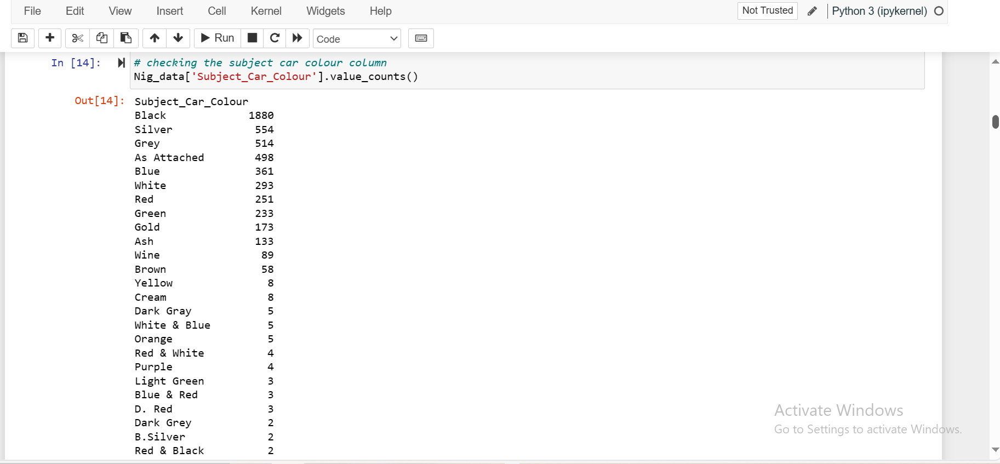
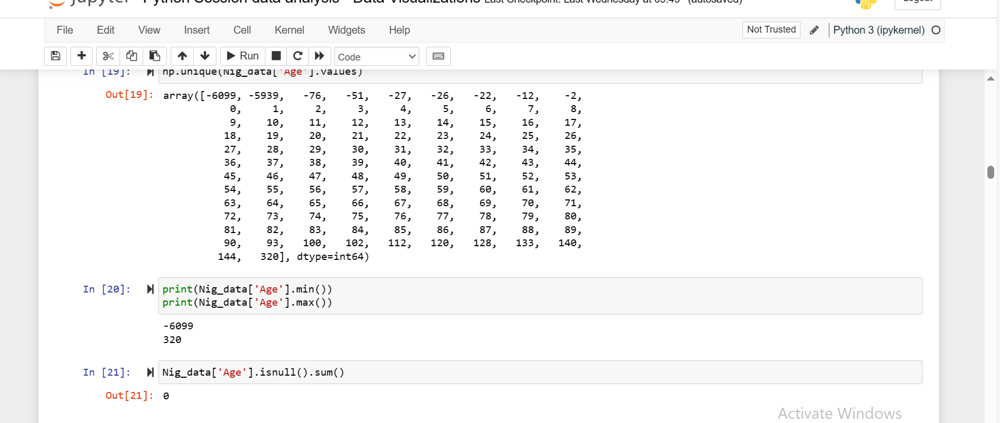

# Data-Cleaning-Analysis-with-python

In my first python project,i performed an extensive data cleaning and analysis on a NIG_DATA dataset using jupyter notebook, i started by importing the *NUMPY* and *PANDAS* library so as to use the functions attached to them,then i imported the dataset using the .read_csv function and assigned it to a variable.

* #### Data Assessment

i started my assessment by firstly checking the number of rows and columns the dataset has, i was able to achieve this by using the ".shape" function, then i checked the column headers using the ".column" function. i also checked for the datatypes of each column using the ".dtypes" function.

 I continued my assessment by subsetting the columns and checking for inconsistencies and null values(nan). then i checked *AGE* column, checked for the minimum and maximum value and also checked for outliers, These are the assessment i made.

 

 

 

 

 

 

 

 after assessing the dataset,i discovered and listed the problems and irregularites within the dataset, so as as to know how to perform the data cleaning.

 
* #### Data Cleaning

  I started the cleaning by assigning the proper datatype to the columns that had datatype issues, and assigning them to the columns. i started with the *GENDER* column

  

  I took a copy of the datatset by i started my cleaning. I also cleaned the column headers by
  
  1. Adding Space between combined values

  2. Converting all caps to capital initials

  3. Replacing . and As attached with others.

  

  in the *AGE* column, i replaced the outliers with the median,then converted it from float to integers. so these are all the cleaning i performed on the columns.

  

  

  

  

  

  

  

  

  

  

  

  

 * #### Exploratory Data Analysis
   i performed an EDA by creating a histogram plot on the *AGE*  column to show the age distribution of the ages. i also created a bar chat on the *SUBJECT_CAR_MAKE* column with the value count while sorting in ascending order.

   

   

 * #### Univariate Analysis

   i imported *matplotlib.pyplot as plt* to perform univariate analysis and create more plots analyzing a single variable.

   

   

   

   

   

 * #### Bivariate Analysis

   I imported *SEABORN* library to conduct bivariate categorical analysis,to create special plots and to understand the relationship between *AGE* and *no_po* column.
   

   

   .

   

   

   

  

  

  

  

  

  

  

  

  
  

 

 

 
 

 

